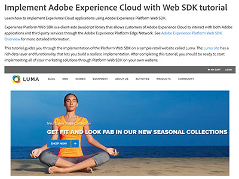

# Tutorial su Audience Manager

Ti diamo il benvenuto nel sito dei tutorial di Audience Manager. Segui questi tutorial e consulta la [documentazione](https://experienceleague.adobe.com/docs/audience-manager/user-guide/aam-home.html) per capire meglio come utilizzare Adobe Audience Manager per creare e attivare tipi di pubblico su qualsiasi canale o dispositivo utilizzando la soluzione leader di Adobe [!DNL data management platform].

* **Le scelte del personale** evidenziano alcuni dei nostri contenuti preferiti
* Esplora il contenuto per argomento e sottoargomento nella **navigazione a sinistra**
* Utilizza il campo **ricerca** nella parte superiore della pagina se sai cosa stai cercando

## Scelte del personale

<table>
<tr>
  <td>
    
    

      <a href="https://experienceleague.adobe.com/docs/platform-learn/implement-web-sdk/overview.html?lang=it">
    <strong>Esercitazione sull'implementazione di Adobe Experience Cloud con Web SDK</strong>
    </a>
    

    

    <em>Scopri come implementare le applicazioni Experience Cloud utilizzando Adobe Experience Platform Web SDK.</em>
    

  </td>
  <td>
    
    

      <a href="https://experienceleague.adobe.com/docs/audience-manager-learn/tutorials/other-integrations/integrating-with-rtcdp/rtcdp-segments-for-aam-users.html">
    <strong>Segmenti in Real-time CDP per gli utenti di Audience Manager</strong>
    </a>
    

    

    <em>Questo video esamina le differenze nei segmenti e nella creazione dei segmenti tra Audience Manager e Real-time CDP.</em>
    

  </td>
  <td>
    
    

      <a href="https://experienceleague.adobe.com/docs/audience-manager-learn/tutorials/build-and-manage-audiences/algorithmic-models/configure-and-report-on-predictive-audiences.html">
    <strong>Configurazione dei Predictive Audiences in Audience Manager</strong> e generazione di rapporti relativi
    </a>
    

    

    <em>Questo video illustra come configurare Predictive Audiences nell'interfaccia Audience Manager.</em>
    

  </td>
</tr>
</table>

