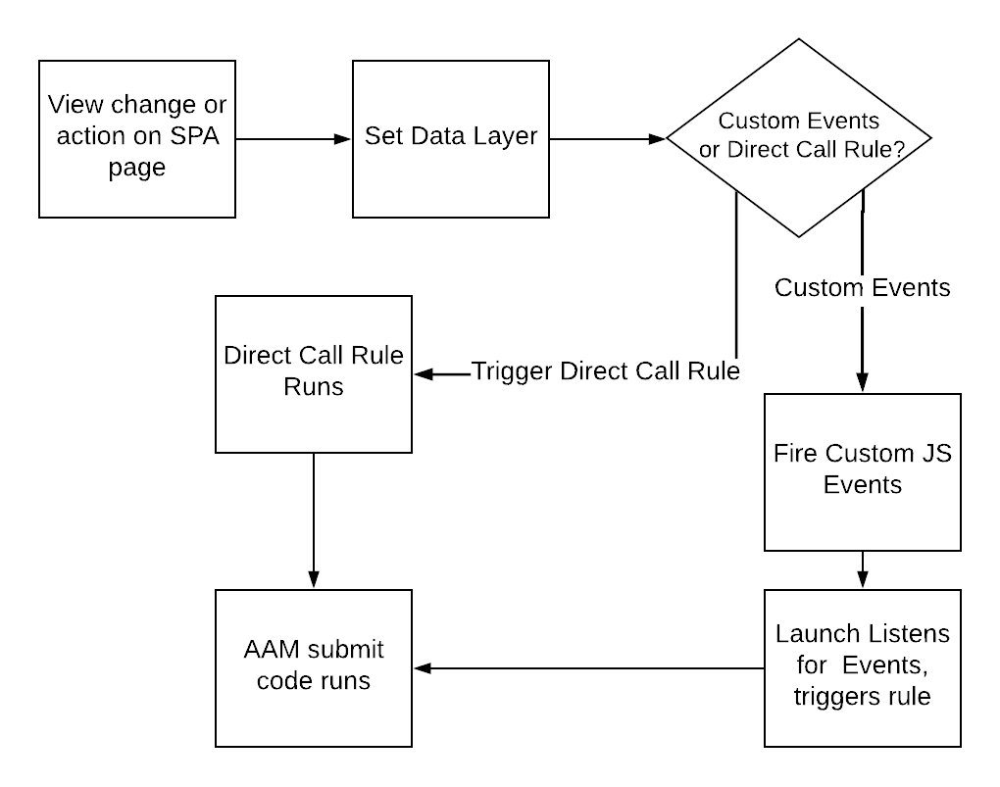

# Best practice per l’invio di dati all’AAM sulle pagine dell’SPA {#using-best-practices-on-spa-pages-when-sending-data-to-aam}

Questo documento descrive diverse best practice per l’invio di dati da applicazioni a pagina singola (SPA) a Adobe Audience Manager (AAM). Questo articolo si concentra sull&#39;utilizzo di [!UICONTROL Experience Platform tags], il metodo di implementazione consigliato.

## Note iniziali

* Gli elementi riportati di seguito presuppongono l’utilizzo di tag Platform per l’implementazione sul sito. Le considerazioni sono valide anche se non utilizzi i tag di Platform, ma dovrai adattarli al tuo metodo di implementazione.
* Tutti gli SPA sono diversi, quindi potrebbe essere necessario modificare alcuni dei seguenti elementi per soddisfare al meglio le tue esigenze, ma Adobe vuole condividere alcune best practice a cui devi pensare quando invii dati dalle pagine SPA agli Audienci Manager.

## Diagramma semplice dell’utilizzo di SPA e AAM nei tag Experience Platform (precedentemente Launch){#simple-diagram-of-working-with-spas-and-aam-in-experience-platform-launch}

>[!NOTE]
>Come indicato, si tratta di un diagramma semplificato del modo in cui le pagine SPA vengono gestite in un’implementazione di Adobe Audience Manager (senza Adobe Analytics) utilizzando i tag di Platform. Come puoi vedere, è abbastanza semplice, con la decisione più importante di comunicare ai tag di Platform una modifica della visualizzazione (o un’azione).

## Attivazione di tag dalla pagina SPA {#triggering-launch-from-the-spa-page}

Due dei metodi più comuni per attivare una regola nei tag Platform (e quindi inviare i dati ad Audience Manager) sono:

* Impostazione di eventi personalizzati di JavaScript (vedi l&#39;esempio [QUI](https://helpx.adobe.com/analytics/kt/using/spa-analytics-best-practices-feature-video-use.html) con Adobe Analytics)
* Utilizzo di [!UICONTROL Direct Call Rule]

In questo Audience Manager, utilizzi un [!UICONTROL Direct Call rule] nei tag Platform per attivare l&#39;hit che va in Audience Manager. Come vedrai nelle sezioni successive, questo diventa utile impostando [!UICONTROL Data Layer] su un nuovo valore, in modo che possa essere rilevato da [!UICONTROL Data Element] nei tag di Platform.

## Pagina demo {#demo-page}

Questa è una piccola pagina che dimostra come modificare un valore nel livello dati e inviarlo ad Audience Manager, come si può fare in una pagina SPA. Questa funzionalità può essere modellata per le modifiche più elaborate necessarie. Puoi trovare questa pagina demo [QUI](https://aam.enablementadobe.com/SPA-Launch.html).

## Impostazione del livello dati {#setting-the-data-layer}

Come accennato, quando un nuovo contenuto viene caricato sulla pagina o quando qualcuno esegue un&#39;azione sul sito, il livello dati deve essere impostato dinamicamente nell&#39;intestazione della pagina PRIMA che i tag di Platform vengano chiamati ed esegua [!UICONTROL rules], in modo che i tag di Platform possano raccogliere i nuovi valori dal livello dati e inviarli all&#39;Audience Manager.

Se vai al sito demo elencato sopra e osservi la sorgente della pagina, vedrai:

* Il livello dati si trova nella parte superiore della pagina, prima della chiamata ai tag di Platform
* Il JavaScript nel collegamento SPA simulato modifica [!UICONTROL Data Layer], quindi chiama i tag di Platform (chiamata `_satellite.track()`). Se si utilizzano eventi personalizzati di JavaScript invece di [!UICONTROL Direct Call Rule], la lezione è la stessa. Modificare [!DNL data layer], quindi chiamare i tag di Platform.

>[!VIDEO](https://video.tv.adobe.com/v/326997/?quality=12&captions=ita)

## Risorse aggiuntive {#additional-resources}

* [Discussione SPA nei forum di Adobe](https://forums.adobe.com/thread/2451022)
* [Architettura di riferimento per mostrare come implementare SPA nei tag di Platform](https://helpx.adobe.com/experience-manager/kt/integration/using/launch-reference-architecture-SPA-tutorial-implement.html)
* [Best practice per il monitoraggio dell&#39;SPA in Adobe Analytics](https://helpx.adobe.com/analytics/kt/using/spa-analytics-best-practices-feature-video-use.html)
* [Sito demo utilizzato per questo articolo](https://aam.enablementadobe.com/SPA-Launch.html)
